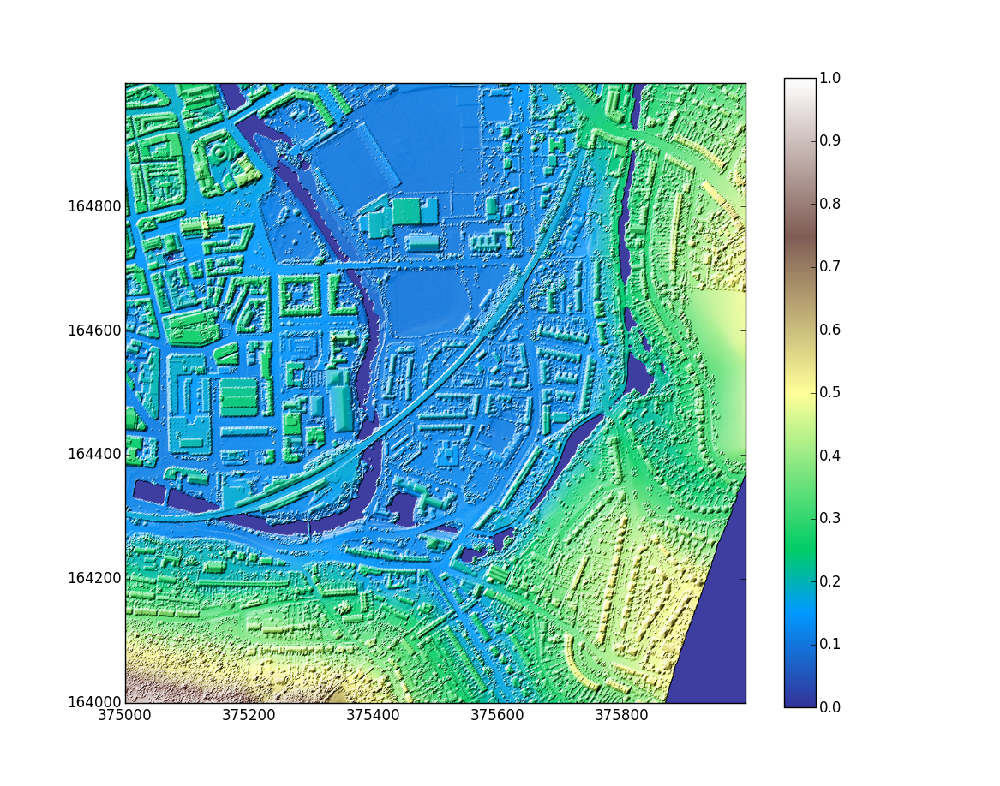
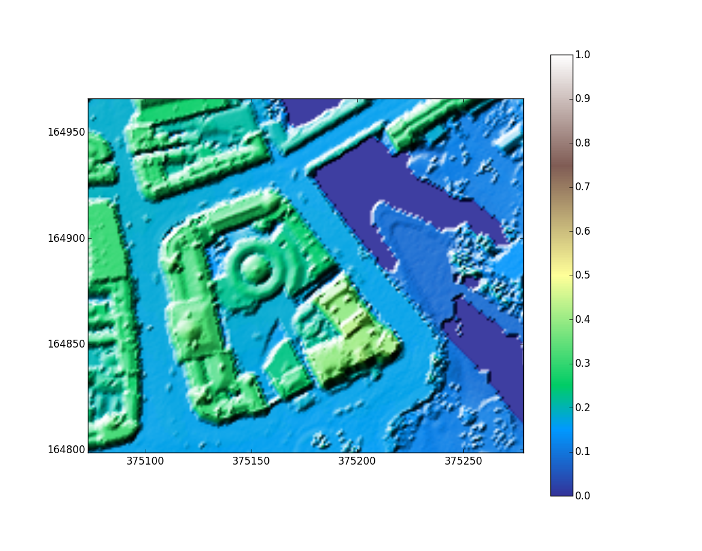

pylidar
=======

pylidar is a Python package developed for use with LIDAR data

At the moment pylidar only supports Digital Surface Model (DSM) files in the .asc format. It stores the LIDAR data internally using `numpy`, a fast and efficient numerical python package. It uses the `matplotlib` library to provide plotting abilities to help visualise the data.

Example code
============

    from pylidar import LIDAR, plt, np
    
    y = LIDAR('../LIDAR/st7564_dsm_1m.asc')
    
    y.plot_shaded()
    
Example plots
=============

### The images below were produced using LIDAR data supplied by [Environment Agency Geomatics](https://www.geomatics-group.co.uk/GeoCMS/Homepage.aspx).

#### The first image shows the South East area of Bath town centre. The River Avon can be seen in purple (actually due to NaN values in the data).

#### The second image is zoomed in from the first image and shows the Guildhall in detail. This particular data set had a 1m resolution and it's possible to see individual cars on the roads.

